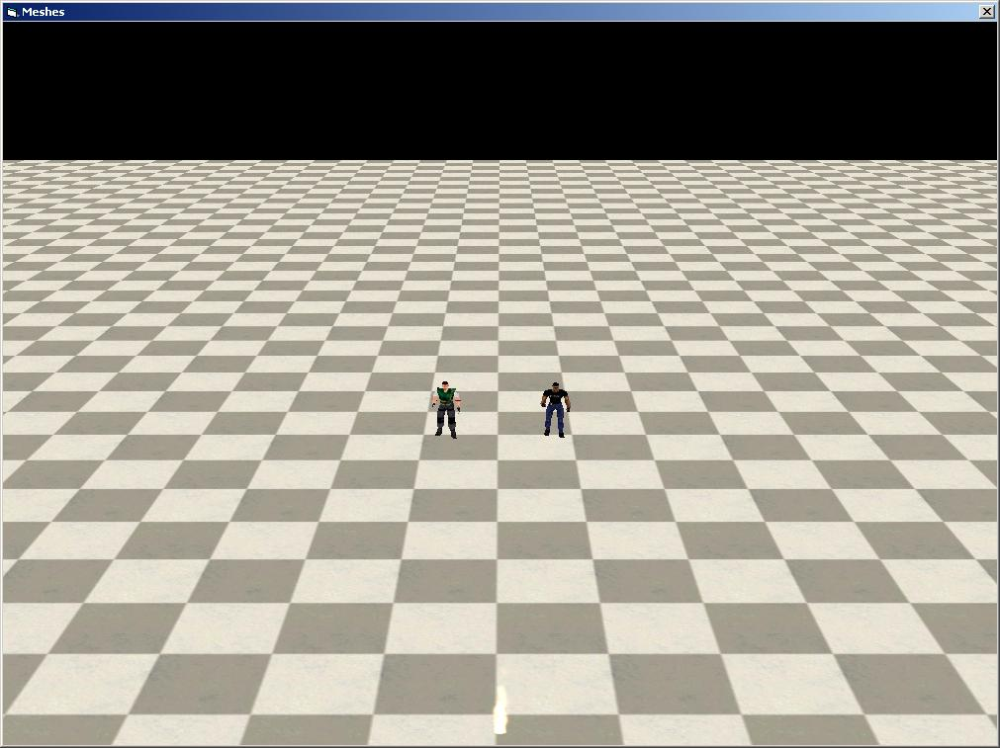



## Skin Mesh

### Description

Please gimme a good vote!

The code simply displays a skinned mesh and allows two computer users to move the characters around the screen.

THANK YOU TO SIMON PRICE FOR TEACHING ME THE BASICS AND THEN SOME!!!

ALSO THANK YOU TO PLANET-SOURCE-CODE FOR HAVING A RELIABLE LEARNING ENVIROMENT!!!

push:

1 2 3 4 5

left

right

up

down

page up

page down

w s a d
 
### More Info
 

             |
---                |---
**Submitted On**   |2005-09-14 23:32:26
**By**             |[Adam Collier](https://github.com/Planet-Source-Code/PSCIndex/blob/master/ByAuthor/adam-collier.md)
**Level**          |Intermediate
**User Rating**    |5.0 (10 globes from 2 users)
**Compatibility**  |VB 6\.0
**Category**       |[DirectX](https://github.com/Planet-Source-Code/PSCIndex/blob/master/ByCategory/directx__1-44.md)
**World**          |[Visual Basic](https://github.com/Planet-Source-Code/PSCIndex/blob/master/ByWorld/visual-basic.md)
**Archive File**   |[Skin\_Mesh1932499142005\.zip](https://github.com/Planet-Source-Code/adam-collier-skin-mesh__1-62561/archive/master.zip)

